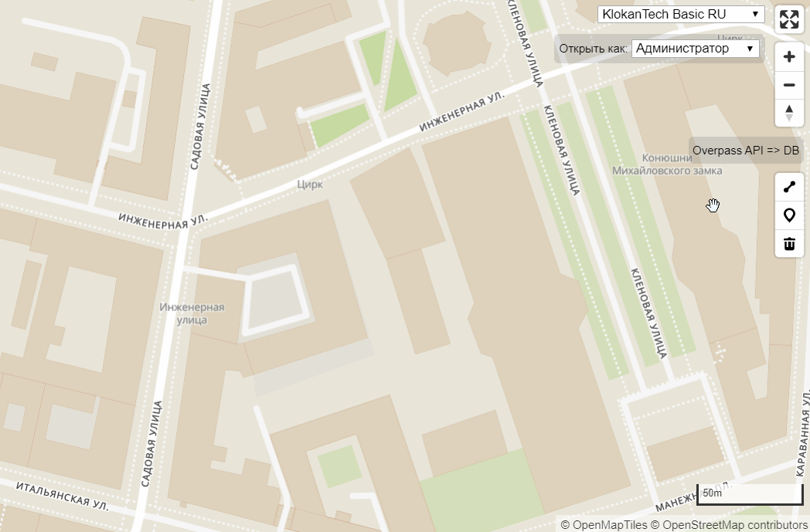
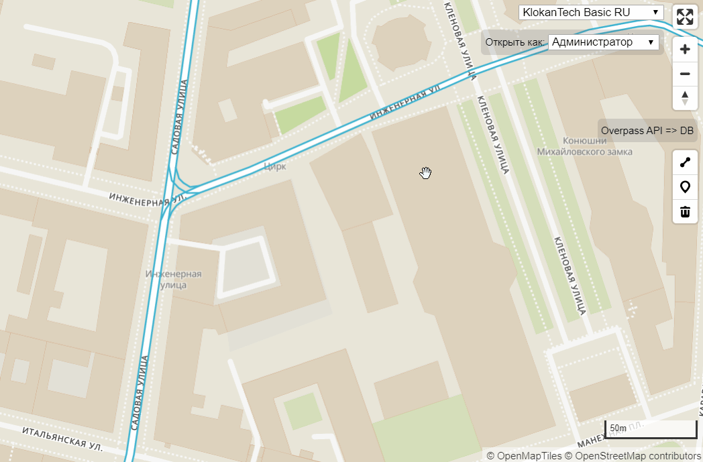
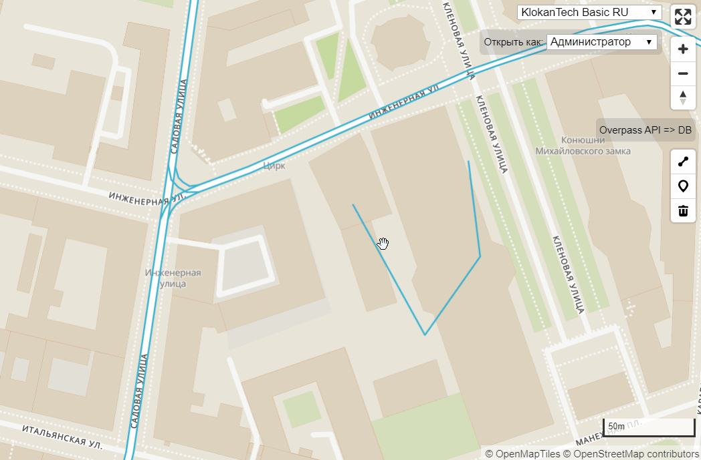

# Hasura PostGIS & React.js Example

An example project to try Hasura features together with PostGIS on back-end.

Front-end was wrote with using React.js & Mapbox GL JS.

## Demo

[Link](https://leaflet-route-editor.herokuapp.com/#16.41/59.937209/30.338115)

### GIF's

    
Load OSM data about tram lines

    

    
Create with drawer

    

    
Edit attributes

    

## References

* Hasura https://hasura.io/
* React.js with hooks https://reactjs.org/
* Apollo GraphQL [client](https://www.apollographql.com/docs/react/)
* Mapbox GL JS https://github.com/mapbox/mapbox-gl-js
* Mapbox GL Draw control https://github.com/mapbox/mapbox-gl-draw [[Custom modes](https://github.com/mapbox/mapbox-gl-draw/blob/master/docs/MODES.md#creating-modes-for-mapbox-draw)]
* PostGIS 3 on PostgreSQL 12 `kzhidovinov/postgis` [Dockerfile](https://github.com/KZhidovinov/postgis-docker/blob/master/Dockerfile)
* [Overpass API](https://wiki.openstreetmap.org/wiki/Overpass_API) [[Query example](Overpass-query.md)]
* Vector tiles from [OpenMapTiles](https://openmaptiles.org/)
